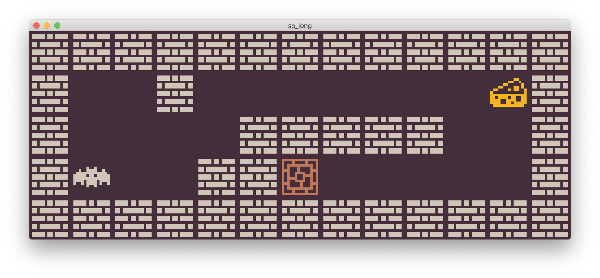
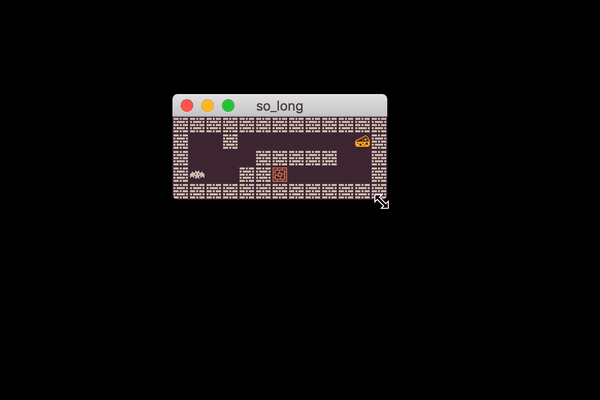
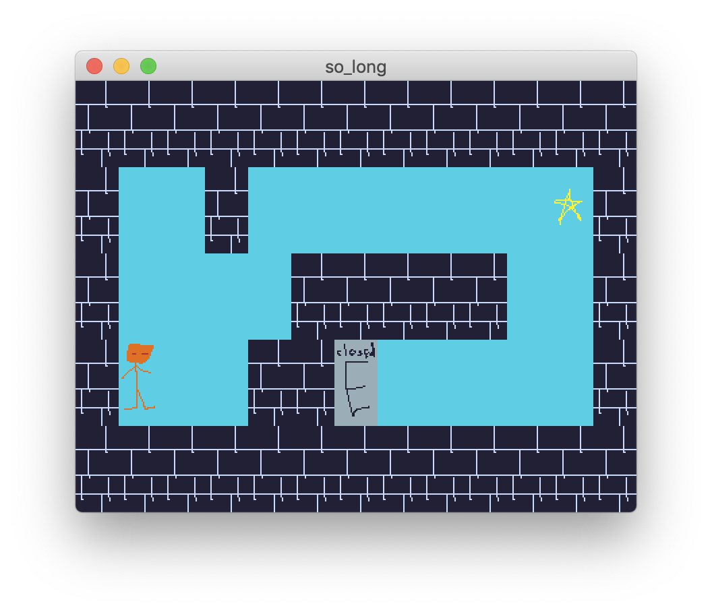

# codam-so_long

## Overview

[Codam](https://www.codam.nl/en/) project: 2D-game build with ascetic graphics library [MLX42](https://github.com/codam-coding-college/MLX42).



## Launch instructions

### Basic flow on school machine

The code compilation works flawless on the school computer (iMac 2017 with Mojave).
Run make in the root of the repo.

```shell
make
```

This will download submodules (MLX42 library and my small library for input and output),
build them and then build the `so_long` itself.

### Troubleshooting

Dependencies for MLX42 are [CMake](https://cmake.org/install/) and [GLFW](https://www.glfw.org/download). On school computer you can install them via Managed Software Center.


On school macs, when linking with glfw, one should pass flag `-lglfw3`. On my home mac linking with this flag fails. It should be replaced with `-lglfw`. I created a variable in my Makefile to make it easier to change this flag. To build the so_long on my computer I use:

```shell
make LIBGLFW_FLAG=-lglfw
```

### Exploration, custom compilation & invokation

Have a look at `notes.md` for more compilation and running scenarios and more tech notes.

## Features

### Basic

Controls: WASD. The goal is to collect all collectibles (cheese) and exit. The number of made steps is displayed on the terminal.

### Extra: resize

I did an effort to support maps that are bigger than screen. It's done via map repositioning in the cases when the map is bigger than the windows size.



### Extra: arbitrary tileset support

One can replace assets at their will. As long as `collectible.png`, `exit_closed.png`,
`exit_open.png`, `player.png`, `wall.png`, have the same dimensions, one can use them. One can replace the assets in the `assets` folder to see the difference. Below is an example using alternative assets (these are drawn by me purely for testing purposes).



### Extra: informative error messages

I not only output an error on misconfiguration but also try to give a good explanation
on what's going wrong. For example I not only tell that a collectible is unreachable, but also tell the position of such collectible, even though it is not required by the task subject. *Note:* I'm not 100% consistent with indexing, some messages use 1-indexing (mostly the ones that treat the data as text) and some — 0-indexing (mostly the ones that are thinking in terms of the coordinates on the map).


## 📃 Credits & License Notes

### Art

Nice assets (assets in folders `assets`, `small_assets`, `big_assets`) are from [1-Bit Pack](https://kenney.nl/assets/1-bit-pack) by [Kenney](https://kenney.nl/). These assetes are CC0-lisenced (same for many of his other assets). Please, support his work.


**License restrictions:** no restrictions

### MLX42

[MLX42](https://github.com/codam-coding-college/MLX42) is a simple graphics library written by [W2Wizard](https://github.com/W2Wizard) that can be used on some campuses of the [School 42](https://42.fr/) network for graphics projects.

**License restrictions:** MLX42 is GPL-2.0, it means that projects using it should be GPL-2.0 as a whole and license other parts under compatible licenses

### Other things

I take for granted a lot of things I use. I'm not a lawyer to draw the line where the credit is due. Examples are: C language and its standard library, git, github, make, vscode, markdown, internet and computers. If you are a lawyer interested in creating templates that credit everything properly, I would love to participate in such project from the technical side (srsly, use contact data on my profile or the contact form (linked below) to start a conversation about it).

**License restrictions:** probably no restrictions

### My code & art

The repo was created by [Oktosha](https://github.com/Oktosha) and licensed under [unlicense](https://unlicense.org/) with the intent to allow you to do whatever you want with the code (no credit required) except for holding me liable. I dedicate my art assets (in the `alternative_assets` folder) to public domain as well. Note that this only applies to my code or art and not the project as a whole because the parts that are not created by me have different licenses.

**License restrictions:** no restrictions intended

### Overall licensing

Overall the project is under GPL-2.0 because of MLX42. The main requirements of GPL-2.0 is that you must open source code of the public projects using GPL-2.0 submodules and release your program under GPL-2.0. Even though the MLX42 author is very chill about licenses students put on their portfolio projects, [unlicense](https://unlicense.org/) in the root of this repo doesn't mean (and can't mean) that you can steal MLX42. Unlicense is only applicable to my code.

**License restrictions:** GPL-2.0 for MLX42 part

## 📚 Further Reading

This project is a small peek into stuff I do at [Codam](https://codam.nl/en). You might be interested in other projects I did there. If so, go to my [codam-meta](https://github.com/Oktosha/codam-meta) repo with the actual info on my Codam projects (including group ones that aren't in my repos!).

I do some out-of-school coding, too. If you want the up-to-date info on my projects, got to my [github profile](https://github.com/Oktosha). At the moment of writing, I'm proud of the following:

+ [Advent of Code 2022 participation](https://github.com/Oktosha/aoc-2022): all stars gathered and I learned Kotlin!
+ [Raytracing in C++17 wrapped with Cython](https://github.com/Oktosha/ray-tracing): done in 2019 (hence the standard version choice) and it is mostly just another completion of [a very enjoyable tutorial](https://raytracing.github.io/books/RayTracingInOneWeekend.html) by Peter Shirley. The twist is that raytracing code is wrapped into a python module that can be used from Jupyter notebook. It was my first time wrapping C++ with Python and for me crossing the boundary between languages felt kinda magical. I guess that's why I'm so attached to this project even though no-one stars it (at the moment of writing)
+ The fact that I can still attest [my blue color](https://codeforces.com/profile/Dashk0) on Codeforeces

If you think we can collaborate, don't hesitate to contact me in some way listed on [my github profile page](https://github.com/Oktosha) or via [this form](https://forms.gle/GCa9ymrYwtTzgiCS8).

<p align="center">💜 💜 💜</p>
